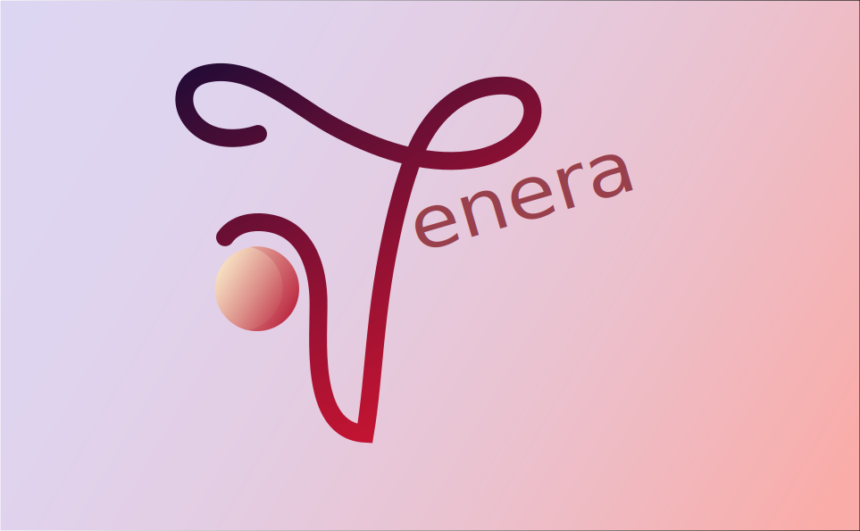

 

## Hello, we are team Venera !

  
We are making a site about the fire places in Burgas and the area. 
You can report an accident, get information about our fire center and read how to deal with disasters.  
You can see our presentation here:
<a href="presentation and documentation/Presentation.pptx" >Presentation</a>

 

#  Participants

 

•Kameliya Yaneva - Scrum Trainer <a href="mailto:KKYaneva19@codingburgas.bg">Send email</a>  
•Vesela Dekova - Designer <a href="mailto:VBDekova19@codingburgas.bg">Send email</a>  
•Petya Petkova - Developer Back-end  <a href="mailto:PIPetkova19@codingburgas.bg">Send email</a>  
•Polina Petrova - Developer Front-end <a href="mailto:PYPetrova19@codingburgas.bg">Send email</a>   

 

#  Used technologies

 

Word  
Teams  
 Instagram  
PowerPoint   
 Visual Studio Code  
 Adobe Illustrator  

 

#  Future ideas

 

1. To improve the logo.  
2. To add a motion logo.  
3. To add more forms.  
4. To use DOM for the forms.  
5. To change the design of the site.  

 

#  Here is how to download our repo:

 

 - Open cmd with Windows + "R";  
 - Type the directory where you want to download the repo;  
 - Type git clone + https://github.com/KKYaneva19/Venera;  
 
Or you can download it from the site.